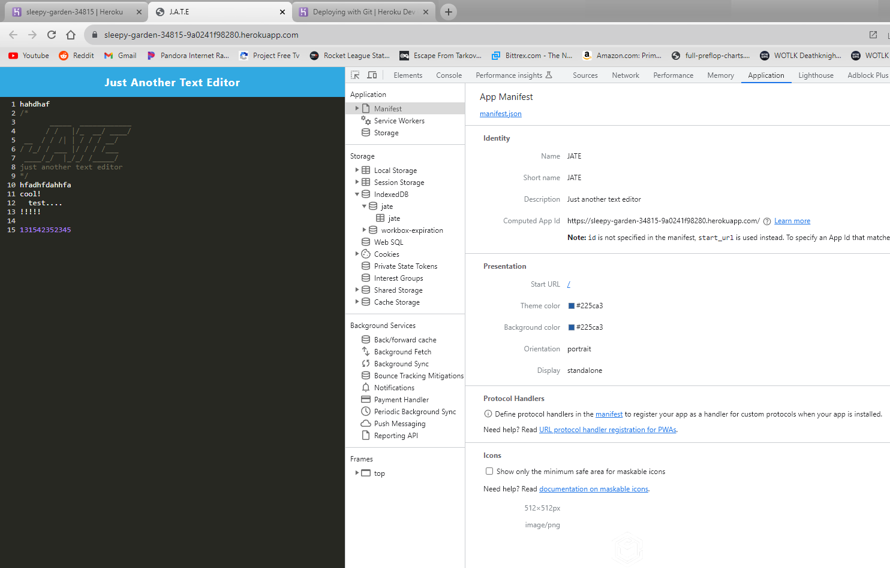

#  PWA Text Editor

## Project Description
An app for text editing in a browser. This is a PWA that can be installed and run offline. It uses IndexedDB for data storage.

## Links

Heroku Link: https://sleepy-garden-34815-9a0241f98280.herokuapp.com/

Github: https://github.com/cdziedzic/PWA-Text-Editor

### Screenshot of content

## Table of contents

- [Installation](#installation)
- [License](#license)
- [Questions](#questions)

### License

### Questions

[My github](github.com/cdziedzic)

E-mail: cdziedzic@gmail.com
